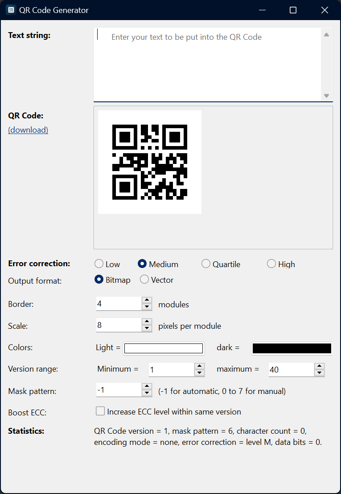

# QR Code Generator

A small graphical application for generating QR codes, written in Free Pascal
(Lazarus / LCL). A port of [Fast-QR-Code-generator](https://www.nayuki.io/page/fast-qr-code-generator-library)
by [Nayuki](https://www.nayuki.io/).
Type or paste text, get a live QR preview, and download the
result as PNG, BMP or SVG. Colors, size and error-correction options are
configurable in the UI.



## Building

Requirements: [Free Pascal](https://www.freepascal.org/) compiler and the
[Lazarus](https://www.lazarus-ide.org/) IDE (LCL). The project depends only on
the LCL package and its vendored QR library — no other packages to install.

Open `qr_generator.lpi` in the Lazarus IDE and build (F9), or from the CLI:

```
lazbuild qr_generator.lpi                          # Default mode
lazbuild --build-mode=Release qr_generator.lpi     # Release mode (-O3, stripped)
```

The binary (`qr_generator.exe` on Windows) is placed next to the project file.

## Continuous integration

[](../../actions/workflows/build.yml)

`.github/workflows/build.yml` builds Windows x86_64 and Linux x86_64 binaries
on every push and pull request and uploads them as workflow artifacts.
Pushing a tag `v*` (e.g. `v1.0.0`) additionally creates a GitHub Release with
ready-made archives.

CI installs FPC 3.2.2 and Lazarus via
`.github/workflows/install-fpc-lazarus.sh` — the same toolchain versions as
used for local development.

## Vendored library

QR code generation is done by
[QRCodeGenLib4Pascal](https://github.com/Xor-el/QRCodeGenLib4Pascal) by
Xor-el, vendored under `QRCodeGenLib4Pascal/` (MIT license, see its `LICENSE`
file). The vendored copy carries one local patch (`patches/lcl-mode.patch`)
that switches it into LCL mode so bitmaps feed `TImage` directly; see
`AGENTS.md` for details and the re-apply procedure after a library update.

## License

This project is released under the [MIT license](LICENSE). The vendored
QRCodeGenLib4Pascal library is distributed under its own MIT license (see
`QRCodeGenLib4Pascal/LICENSE`).
